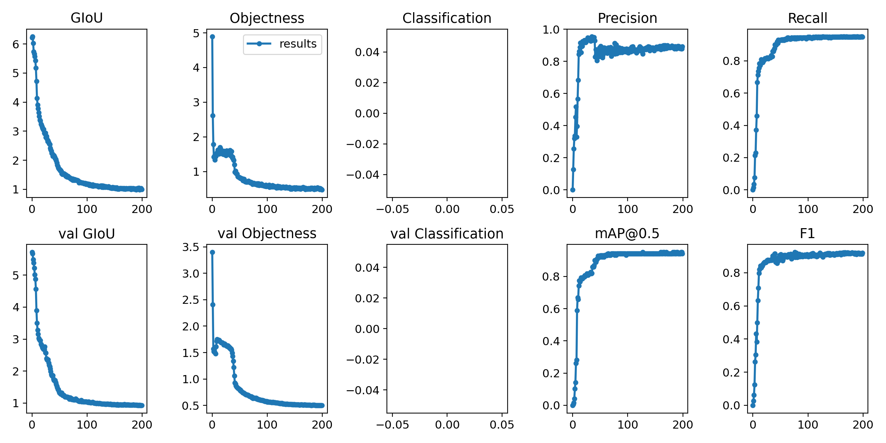

# Training and evaluating model
This part contains training and evaluating code for YOLOv3 in Pytorch. The code works on Linux, MasOS, Windows.
## Setup environment
[Python 3.7](https://www.python.org/downloads/) or later with all dependencies into [requirements.txt](requirements.txt), include torch >= 1.6.0 and CUDA 9.2, 10.1 or 10.2. To install run command as below:
```bash
# Create virtual environment
$ virtualvenv -p python3 <venv-name>
# Activate virtual environment
$ source <venv-name>/bin/activate
# Install dependencies
$ pip install -r requirements.txt
```
## Training
### Preparation
1. Supported format image: PNG, JPG, JPEG, BMP, TIF, TIFF, DNG
2. Preparing dataset before training model, images and labels should be the same directory. Example:
```
<folder>/video_traffic_Lane-splitting+in+Tokyo.9793_1.png
<folder>/video_traffic_Lane-splitting+in+Tokyo.9793_1.txt
<folder>/video_traffic_Lane-splitting+in+Tokyo.9871_0.png
<folder>/video_traffic_Lane-splitting+in+Tokyo.9871_0.txt
```

3. Format annotation: YOLO format(label index, x center, y center, width, height) and normalized to range [0-1].
```
0 0.31301 0.739396 0.152211 0.081443
0 0.736227 0.638111 0.155158 0.134889
1 0.421086 0.755491 0.155272 0.079191
```
4. Split dataset into 3 parts of training-, validation-, test-set. Then, write all paths to image into csv file for each part.
```bash
# train.csv
ailibs_data/dataset/video_motorbike_motorcycle+paradise+Japan29703_2.png
ailibs_data/dataset/video_traffic_Driving.png
ailibs_data/dataset/video_traffic_Driving_0.png
ailibs_data/dataset/video_traffic_Lane-splitting+in+Tokyo.23934_2.png

# valid.csv
ailibs_data/dataset/video_traffic_Lane-splitting+in+Tokyo.17753_1.png
ailibs_data/dataset/video_traffic_Lane-splitting+in+Tokyo.24387_0.png
ailibs_data/dataset/video_parking_lot_In+Japanese+car+park,+spot+parks+YOU!!258_0.png
ailibs_data/dataset/video_motorbike_motorcycle+paradise+Japan10526_1.png

# test.csv
ailibs_data/dataset/video_traffic.png
ailibs_data/dataset/video_motorbike_motorcycle+paradise+Japan33894_0.png
ailibs_data/dataset/video_traffic_Lane-splitting+in+Tokyo.16577_0.png
ailibs_data/dataset/images_car_DSC00129-1200x800_1.jpgEE
```
5. Defining training configuration file
- Class name file
```bash
# lp.names
license_plate
```
- Data file
```bash
# lp.data
classes=1
train=ailibs_data/train.csv
valid=ailibs_data/valid.csv
test=ailibs_data/test.csv
names=ailibs/detector/yolov3/cfg/lp.names

```
- Model configuration file(follow to YOLO, can found at [https://github.com/ultralytics/yolov3/tree/master/cfg](https://github.com/ultralytics/yolov3/tree/master/cfg))

## Start training
1. Download [YOLO weights](https://drive.google.com/drive/folders/1LezFG5g3BCW6iYaV89B2i64cqEUZD7e0) that trained with ImageNet dataset. Using that weights to initialize parameters for model.

2. Run below command to begin training model
```bash
# Forgetting to activate virtual environment

# Training command
$ python training/train.py --epochs 300 --batch-size 4 --cfg ailibs/detector/yolov3/cfg/yolov3-lp.cfg --data training/lp.data --multi-scale --img-size 320 --weights ailibs_data/weights/yolov3.pt
```
3. Reproduce results

Don't worry about classification loss is always equals 0(Because in this example, we only train on single class)



Result showed GIOU loss, Objectness loss, Classification loss, Precision, Recall, val GIOU, val Objectness, val Classification loss, mAP, F1-score

4. After training model completely, source code automatically saved best checkpoint(evalute on weights 0.15, 0.3, 0.35, 0.2 for Precison, Recall, mAP, F1-score, respectively)

## Evaluating
Evaluating model follow to [evaluating guideline](./evaluating/README.md)